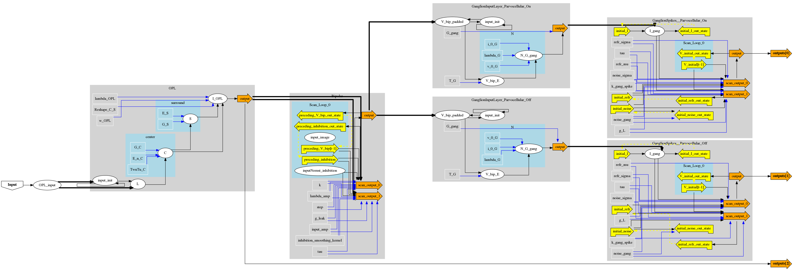

**Note:** The latest PyTorch version (`0.4`) merged Tensors and Variables.
The current convis release was adapted to this change, but it is still possible
that something broke in the change, so please report any Exceptions thrown by
PyTorch [in the issue tracker](https://github.com/jahuth/convis/labels/bug).

# The `convis` package

This python package provides an implementation of the [Virtual Retina](http://www-sop.inria.fr/neuromathcomp/public/software/virtualretina/) developed by Adrien Wohrer. It uses `PyTorch` to simulate spike trains of retinal ganglion cells by directing the input through a number of computation layers. Each layer might do linear or nonlinear computations, eg. convolve the inpute with a spatio-temporal kernel or apply gain control.

TravisCI on the master branch: [](https://travis-ci.org/jahuth/convis) 

We are supporting Python 3.5 and 2.7 right now, but are aiming to support Python 3.6 as well.

Convis is under development and some features might not work in the current master branch or the PyPi releases.
If you discover unexpected behaviour, please leave an Issue on github.

Also there are two mailing lists for people interested in Convis:

 * To recieve announcements of changes, please subsribe to: [convis-users@googlegroups.com](https://groups.google.com/forum/#!forum/convis-users)
 * If you want to participate in the development, please subscribe to: [convis-dev@googlegroups.com](https://groups.google.com/forum/#!forum/convis-dev)

Find the documentation at: [https://jahuth.github.io/convis/](https://jahuth.github.io/convis/)

Usage Example:

```python
import numpy as np
import matplotlib.pylab as plt
import convis

c = convis.retina.RetinaConfiguration()
ret = convis.retina.Retina(c)
inp = np.zeros((2000,50,50))
inp[:,20:30,20:30] = 255.0*(rand(*inp[:,20:30,20:30].shape)<0.2)
out = ret.run(inp)

plt.plot(np.mean(out[0],(0,1,3,4)))
plt.plot(np.mean(out[1],(0,1,3,4)))
```

An earlier version using `theano` has been put on hold, but is still available [here](http://github.com/jahuth/convis_theano). If you are interested in continued development of the `theano` version, please let me know!
An even older version was published as <a href="https://github.com/jahuth/retina">the retina package</a>

When using `convis` for your scientific publications, please cite:

 * Huth J, Masquelier T and Arleo A (2018) Convis: A Toolbox to Fit and Simulate Filter-Based Models of Early Visual Processing. Front. Neuroinform. 12:9. doi: 10.3389/fninf.2018.00009

## Installation

Installing `convis` and `PyTorch` itself is not complicated.


Requirements for the base installation are: Python 2.7 or Python 3.5, Numpy, SciPy.

The current PyTorch version built for CUDA 8 can be installed via conda or pip:
```bash
conda install pytorch -c pytorch 
# or
pip install torch torchvision
```
For other CUDA versions, installing via pip on Windows etc., see the [PyTorch website](https://pytorch.org/).

Once the requirements are installed, `convis` can be installed via pip for the latest release:
```bash
pip install convis
```

or from the most up-to-date version from github:

```bash
pip install git+https://github.com/jahuth/convis.git
```

Alternatively, you can clone the repository and install it locally:

```bash
git clone https://github.com/jahuth/convis.git
cd convis
# change something in the source code
pip install -e convis
```


I recommend installing opencv, and jupyter notebook, if you do not already have it installed:

```bash
pip install convis notebook
# eg. for ubuntu:
sudo apt-get install python-opencv
```

## Introduction

`convis` provides a retina model which is identical to `VirtualRetina` and tools
to create either simpler or more complex models.

The paper about `convis` is available in frontiers in Neuroinformatics: 
["Convis: A Toolbox To Fit and Simulate Filter-based Models of Early Visual Processing"](https://www.frontiersin.org/articles/10.3389/fninf.2018.00009/full).

## The Retina model

A description of all parameters for the retina model can be obtained directly from
an instantiated model. This description contains doc strings for each parameter.
```python
import convis
retina = convis.retina.Retina()
print(retina)
```

Here is a graph of the model:
<a href="retina_graph.png"></a>

To use the model, supply a numpy array as an argument to the `Retina` (for short input) or to the `run` function with a `dt` keyword to split the input in smaller chunks (and automatically reassemble the output):

```python
import numpy as np
import matplotlib.pylab as plt
inp = np.ones((100,20,20))
output = retina(inp)
    
inp = np.ones((2000,20,20))
output = retina.run(inp,dt=100)
```

It will return an `Output` object containing all outputs of the model (the default for retina is two outputs: spikes of On and Off cells).

```python
convis.plot_5d_time(output[0])
title('On Cells (1 line = 1 pixel)')
figure()
convis.plot_5d_matshow(output[0][:,:,::50,:,:])
title('Every 50th frame of activity')
figure()
# dimension 2 is time, so we mean over all others
# to get the average activity
convis.plot_5d_time(output[0].mean((0,1,3,4)))
convis.plot_5d_time(output[1].mean((0,1,3,4)))
title('Mean Activitiy of On and Off Cells')
```

The output object holds the ouput of the computation (in most cases `torch.autograd.Variables`) but can be converted to a `numpy` array with `output.array(...)`. Outputs can be addressed with numbers or names.

```python
>>> type(output[0])
<class 'torch.autograd.variable.Variable'>
>>> type(output[0].data.cpu().numpy())
<class 'numpy.ndarray'>
>>> type(output.array(0))
<class 'numpy.ndarray'>
>>> output[0] is output.ganglion_spikes_ON
True
>>> output[0] is output['ganglion_spikes_ON']
True
>>> np.sum(abs(output.array('ganglion_spikes_ON') - output.array(0)))
0
```

If instead of spikes, only the firing rate should be returned, the retina can be initialized without a spiking mechanism:

```python
retina_without_spikes = convis.retina.Retina(spikes = False)
```

## Found a bug or want to contribute?

Bug reports and feature requests are always welcome!
The best place to put them is the [github issue tracker](https://github.com/jahuth/convis/issues).
If you have questions about usage of functions and classes and can not find 
an answer in the documentation and docstrings, this is considered a bug and I appreciate
it if you open an issue for that!

If you want, you can flag your issue already with one of the labels:

 * [bug](https://github.com/jahuth/convis/labels/bug)
 * [enhancement](https://github.com/jahuth/convis/labels/enhancement)
 * [missing documentation](https://github.com/jahuth/convis/labels/missing%20documentation)
 * [question](https://github.com/jahuth/convis/labels/question)

If you have fixed a bug or added a feature and you would like to see the change
included in the main repository, the preferred method is for you to commit the 
change to a fork on your own github account and submit a pull request.


General discussion is encouraged on the two mailing lists:
 * [convis-users@googlegroups.com](https://groups.google.com/forum/#!forum/convis-users) for announcements and user questions
 * [convis-dev@googlegroups.com](https://groups.google.com/forum/#!forum/convis-dev) for discussions about the development


